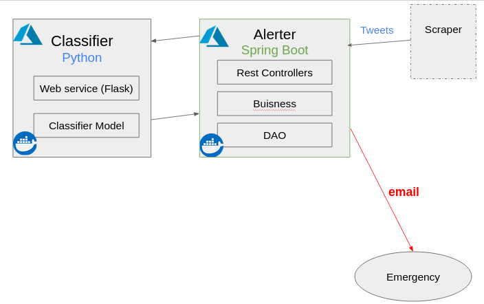

# disaster-tweets
This project contains two microservices:



# 1. Disaster Tweets Classification Microservice

This microservice is a simple Python-based web application built using the Flask framework. It is designed to classify tweets related to disasters such as earthquakes, hurricanes, and wildfires.

## Installation

To install and run this microservice, you will need to have Python 3 and Docker installed on your machine.

1.  Clone the repository to your local machine using Git:

```
git clone git@gitlab.com:mohamedhamri/disaster-tweets.git

```

2.  Navigate to the root directory of the project:

```
cd disaster-tweets

```

3.  Build the Docker image:

```
docker build -t disaster-tweets-classification .

```


4.  Run the Docker container:

```
docker run -p 5000:5000 disaster-tweets-classification

```
the microservice will now be running on your local machine at http://localhost:5000.

## API (Rest Web Service)

The microservice exposes a single API endpoint for classifying tweets:

```
POST /predict
```

The request body should be a JSON object with a single field, tweet, containing the tweet text to be classified.

Example request:

```
{
    "tweet": "There's a wildfire raging out of control in California right now"
}
```

The response will be a JSON object with a single field, named "relevant" with a true or false value.
```
{
    "relevant": true
}
```

# 2. Emergency Alerts Microservice

This microservice is a Java-based web application built using Spring Boot. It is designed to send emails alerting of emergencies detected by the Disaster Tweets Classification Microservice.

## Dependencies

This microservice depends on the Disaster Tweets Classification Microservice for detecting emergencies. The Disaster Tweets Classification Microservice must be running and accessible from the Emergency Alerts Microservice.

## Installation

To install and run this microservice, you will need to have Java 8 and Docker installed on your machine.

1.    Clone the repository to your local machine using Git:
```
git clone git@gitlab.com:mohamedhamri/disaster-tweets.git

```

2.   Navigate to the root directory of the project:
```
cd disaster-tweets-classification
```

3.    Build the Docker image:
    - [ ] Using docker build line command:
```
docker build -t disastertweets/disaster-tweets-alerter .
```

    - [ ] Using maven:
```
mvn package dockerfile:build

```

4.    Run the Docker container:

docker run -disastertweets/disaster-tweets-alerter

The microservice will now be running on your local machine at http://localhost:80.


## API (Rest)

The microservice exposes a 2 API endpoints for classifying tweets, and alerting:

```
POST /alert/verify
```

The request body should be a JSON object with a single field, tweet, containing the tweet text to be classified.

Example request:

```
{
    "tweet": "There's a wildfire raging out of control in California right now"
}
```
If the tweet is classifed as a disaster an email conataing the message of the tweet will be send the emregencies to alert them.

The response will be a String containg "true" in case of a sucessful alert otherwise it will return "false".
exemple:
```
true
```

The second endpoint just for testing the alert
```
POST /alert/alert
```
This request will send an alert email to the emergency.

## Configuration

The Emergency Alerts Microservice requires the following configuration options:

    DISASTER_TWEETS_CLASSIFICATION_URL: The URL of the Disaster Tweets Classification Microservice.
    SMTP_HOST: The hostname of the SMTP server to use for sending emails.
    SMTP_PORT: The port of the SMTP server to use for sending emails.
    SMTP_USERNAME: The

# Deployement:

In addition to being able to run locally using Docker, both the Disaster Tweets Classification Microservice and the Emergency Alerts Microservice are also deployed on Azure and are accessible from the internet via public IP addresses. This allows them to be accessed and used by other applications and services. To access the microservices on Azure, simply use the public IP address of the Azure instance in place of the localhost address when making API calls.

- [ ] Disaster Tweets Classification Microservice : http://4.152.192.132

- [ ] Emergency Alerts Microservice : http://52.167.23.138

# Authors

This project was developed by 
    - Mohamed Hamri (mohamed.hamri@usmba.ac.ma).
    - Issam Benhammou (issam.benhammou@usmba.ac.ma)